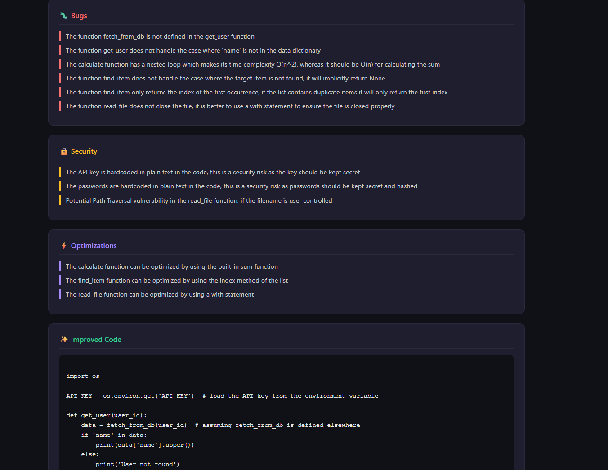
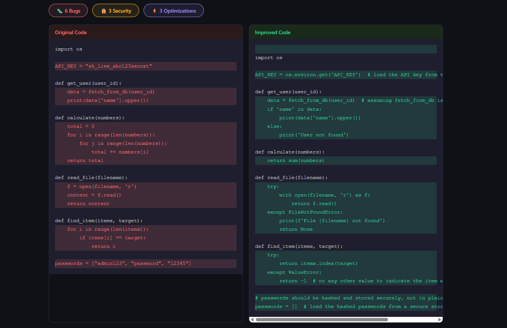

# ⚡ SmartCode Reviewer

> An AI-powered code analysis platform that reviews your code like a senior engineer — detecting bugs, security vulnerabilities, and performance issues in seconds.


---

## 🎯 What it does

Paste any code snippet, select your language, and get instant structured feedback:

- **Bug Detection** — Null pointer risks, logic errors, bad patterns
- **Security Analysis** — Hardcoded secrets, unsafe inputs, data leaks  
- **Performance Optimization** — Complexity improvements, better algorithms
- **Side-by-Side Diff** — Visual line-by-line comparison of original vs improved code
- **Language Mismatch Detection** — Warns when code doesn't match selected language
- **Analysis History** — Every analysis saved and accessible with full detail view

---

## 📸 Screenshots




---

## 🛠️ Tech Stack

| Layer | Technology | Purpose |
|---|---|---|
| Frontend | React.js | Component-based UI |
| Styling | CSS3 | Custom dark theme |
| Backend | Node.js + Express | REST API server |
| Database | MongoDB + Mongoose | Analysis history storage |
| AI | Groq API (LLaMA 3.3 70B) | Code analysis engine |

---

## 🏗️ Architecture

```
React (port 3000)
      ↓  HTTP POST /analyze
Express (port 5000)
      ↓  Structured prompt
Groq AI (LLaMA 3.3 70B)
      ↓  JSON response
MongoDB  ←  saves analysis history
      ↓
React renders results
```

---

## 📁 Project Structure

```
smart-code-reviewer/
├── client/                     # React Frontend
│   └── src/
│       ├── components/
│       │   └── DiffViewer.js   # Side-by-side diff component
│       ├── App.js              # Main app with tabs + state
│       └── App.css             # Dark theme + responsive styles
│
└── server/                     # Node.js Backend
    ├── config/
    │   └── db.js               # MongoDB connection
    ├── models/
    │   └── Analysis.js         # Mongoose schema
    ├── services/
    │   └── gemini.js           # AI prompt + response parsing
    └── index.js                # Express routes
```

---

## 🚀 Getting Started

### Prerequisites

- Node.js v18+
- MongoDB installed locally
- Free Groq API key → [console.groq.com](https://console.groq.com)

### Installation

```bash
# Clone the repo
git clone https://github.com/Himanshu-pant2005/smart-code-reviewer.git
cd smart-code-reviewer
```

```bash
# Install server dependencies
cd server
npm install
```

```bash
# Install client dependencies
cd ../client
npm install
```

### Environment Setup

Create `server/.env`:

```env
PORT=5000
GROQ_API_KEY=your_groq_api_key_here
MONGO_URI=mongodb://localhost:27017/smartcode
```

### Run

Open two terminals:

```bash
# Terminal 1 — Backend
cd server && npm run dev

# Terminal 2 — Frontend
cd client && npm start
```

Visit **http://localhost:3000**

---

## 🧪 Try it out

Paste this into the editor with **Python** selected:

```python
API_KEY = "sk_live_abc123secret"

def get_user(user_id):
    data = fetch_from_db(user_id)
    print(data['name'].upper())

def calculate(numbers):
    total = 0
    for i in range(len(numbers)):
        for j in range(len(numbers)):
            total += numbers[i]
    return total

def read_file(filename):
    f = open(filename, 'r')
    return f.read()
```

You should see: hardcoded API key, O(n²) nested loop, missing null check, unclosed file handle.

---

## 🗺️ Roadmap

- [x] AI code analysis engine
- [x] Structured JSON response parsing
- [x] Side-by-side diff viewer
- [x] Analysis history with MongoDB
- [x] Language mismatch detection
- [x] Re-analyze without duplicate saves
- [x] Responsive dark theme UI
- [ ] AI Chat — ask follow-up questions about your code
- [ ] GitHub repository analyzer
- [ ] User authentication
- [ ] Deploy to production

---

## 🤝 Contributing

Pull requests are welcome. For major changes please open an issue first.

---

## 📄 License

[MIT](LICENSE) — feel free to use this project however you like.

---

<p align="center">Built with 💜 using the MERN stack + Groq AI</p>